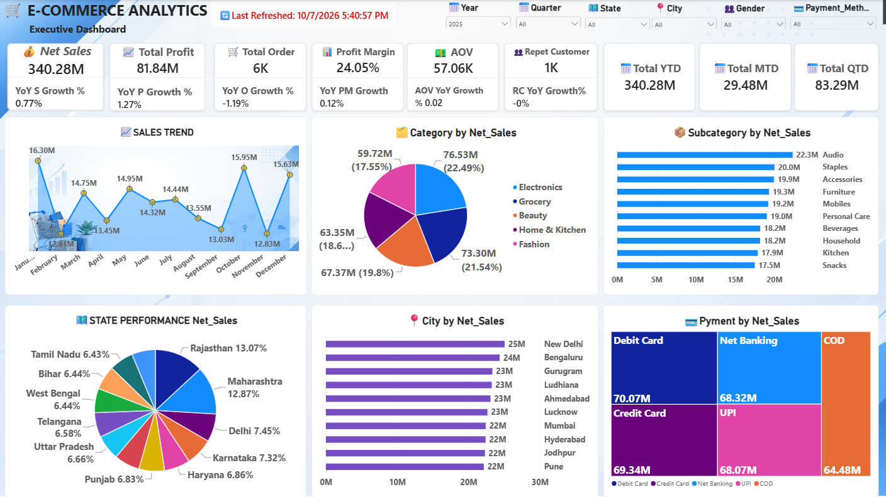
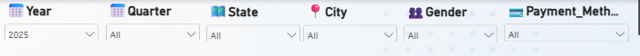
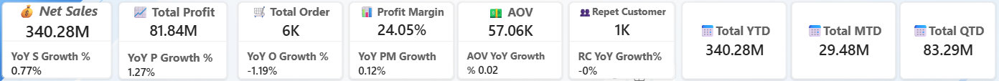
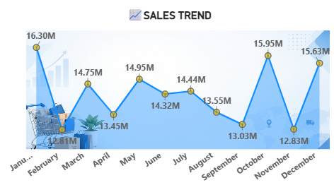
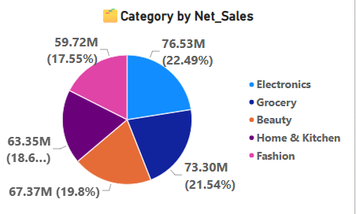
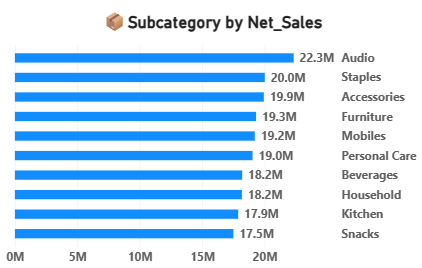
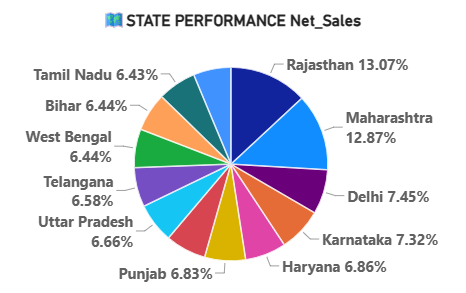
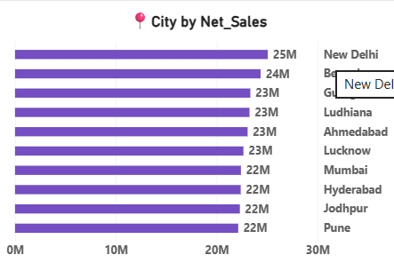
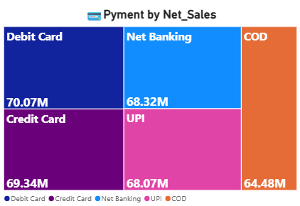

🛒 E-Commerce Analytics — Executive Dashboard

## 1. Dashboard Overview

The **E-Commerce Analytics Executive Dashboard** was developed in Power BI to provide management with a consolidated view of sales, profitability, customer behavior, order performance and payment trends.

The dashboard combines **DAX measures, time-intelligence calculations, interactive slicers and multiple visualizations** to help decision-makers monitor business performance and identify growth opportunities.

### Key areas covered

- Net Sales
- Total Profit
- Total Orders
- Profit Margin
- Average Order Value (AOV)
- Repeat Customers
- YTD / MTD / QTD Sales
- YoY Growth
- Monthly Sales Trend
- Category Performance
- Subcategory Performance
- State Performance
- City Performance
- Payment Method Performance

---


# 🎛️ 2. Interactive Filters

Dashboard ke top par ye slicers diye gaye hain:

### Year

Year slicer se user particular year select kar sakta hai.

Example:

**2025**

Agar 2025 select hai, to dashboard ke visuals aur KPIs 2025 ke data ke according filter ho jayenge.

### Quarter

Quarter ke according analysis karne ke liye.

Example:

- Q1
- Q2
- Q3
- Q4

### State

Specific state ka performance analyze karne ke liye.

Example:

> Rajasthan

### City

Specific city ke sales performance ko analyze karne ke liye.

Example:

> Jaipur

### Gender

Customer gender ke according analysis.

### Payment Method

Payment method ke according sales analyze ki ja sakti hai:

- Debit Card
- Credit Card
- Net Banking
- UPI
- COD

### Business Benefit

Ye slicers management ko **interactive analysis** provide karte hain.

For example:

> “2025 mein Rajasthan ke male customers ne UPI se kitni sales ki?”

User multiple slicers select karke directly iska answer dashboard se nikal sakta hai.

---


# 💰 3. Executive KPI Cards

Dashboard ke top par important business KPIs display kiye gaye hain.

---

## KPI 1 — Net Sales

### Current Value

**340.28M**

Iska matlab selected filter context mein approximately:

**340.28 million**

net sales generate hui.

Aapka DAX:

```
Total Net Sales =
SUM(Orders[Net_Sales])
```

### Business Meaning

Ye company ke overall sales performance ka primary KPI hai.

Management isse dekh sakta hai:

> “Company ne kitni net sales generate ki?”

### YoY Sales Growth

Dashboard par:

**0.77%**

Ye current period ki sales ko previous-year sales ke saath compare karta hai.

Formula:

```
YoY Sales Growth % =
DIVIDE(
    [Total Net Sales] - [Previous Year Sales],
    [Previous Year Sales]
)
```

### Business Interpretation

Positive value:

> Sales previous year se increase hui.

Negative value:

> Sales previous year se decrease hui.

---

# 💵 4. Total Profit

Dashboard value:

**81.84M**

DAX:

```
Total Profit =
SUM(Orders[Profit])
```

### Business Meaning

Company ne selected period mein approximately **81.84M profit** generate kiya.

### Why Important?

Sirf sales dekhna enough nahi hai.

Example:

Company A:

> Sales = ₹100M  
> Profit = ₹5M

Company B:

> Sales = ₹80M  
> Profit = ₹15M

Company B ki sales kam hain, lekin profitability better hai.

Isliye **Sales + Profit dono** analyze karna important hai.

---

## YoY Profit Growth

Dashboard:

**1.27%**

Iska matlab current profit previous year ke comparison mein approximately **1.27% higher** hai.

DAX:

```
YoY Profit Growth % =
DIVIDE(
    [Total Profit] - [Previous Year Profit],
    [Previous Year Profit]
)
```

---

# 🛒 5. Total Orders

Dashboard:

**6K**

DAX:

```
Total Orders =
DISTINCTCOUNT(Orders[order_id])
```

### Why DISTINCTCOUNT?

Agar ek order mein multiple products hain, to `Order_items` mein same `order_id` multiple times aa sakta hai.

Example:

|order_id|product|
|---|---|
|1001|Mobile|
|1001|Headphones|
|1001|Charger|

Yahan transaction rows 3 hain, lekin actual order **1** hai.

Isliye:

```
DISTINCTCOUNT(Orders[order_id])
```

use kiya gaya.

### Business Question

> “Company ko total kitne orders mile?”

---

# 📈 6. YoY Order Growth

Dashboard:

**-1.19%**

Iska meaning:

Current year mein orders previous year ke comparison mein approximately **1.19% decrease** hue.

Ye interesting business insight hai:

> Sales +0.77% grow hui, lekin orders -1.19% decrease hue.

Iska possible meaning ho sakta hai ki customers **per order zyada spend** kar rahe hain.

Isko verify karne ke liye AOV dekhna important hai.

---

# 💰 7. Profit Margin

Dashboard:

**24.05%**

DAX:

```
Profit Margin % =
DIVIDE(
    [Total Profit],
    [Total Net Sales]
)
```

### Formula

**Profit Margin = Profit ÷ Net Sales × 100**

Approx:

**81.84M ÷ 340.28M ≈ 24.05%**

### Business Meaning

Har ₹100 net sales mein approximately:

**₹24.05 profit**

generate ho raha hai.

### Why Important?

Management ko ye pata chalta hai ki sales kitni **profitable** hain.

---

# 📊 8. YoY Profit Margin Change

Dashboard:

**0.12%**

Aapka measure:

```
YoY Profit Margin Change =
[Profit Margin %] -
[Previous Year Profit Margin %]
```

Ye normal YoY growth nahi hai.

Ye **percentage-point difference** show karta hai.

Example:

Current Margin:

**24.05%**

Previous Margin:

**23.93%**

Difference:

**0.12 percentage points**

### GitHub par isko preferably:

**YoY Profit Margin Change**

likhna better hai instead of simply:

**YoY PM Growth**

because ye actual growth percentage nahi, margin difference hai.

---

# 💵 9. AOV — Average Order Value

Dashboard:

**57.06K**

DAX:

```
AOV =
DIVIDE(
    [Total Net Sales],
    [Total Orders]
)
```

### Formula

**AOV = Total Net Sales ÷ Total Orders**

Example:

₹340.28M ÷ approximately 6K orders

≈ ₹57K per order.

### Business Meaning

Average customer/order approximately **₹57K** generate kar raha hai.

### Why Important?

AOV se company ye samajh sakti hai:

> “Ek average order se kitni sales generate ho rahi hain?”

AOV increase karne ke methods:

- Cross-selling
- Upselling
- Product bundles
- Minimum order offers
- Premium products

---

# 👥 10. Repeat Customers

Dashboard:

**1K**

Aapka measure customers ko identify karta hai jinhone **2 ya usse zyada orders** place kiye hain.

```
Repeat Customers =
COUNTROWS(
    FILTER(
        SUMMARIZE(
            Orders,
            Orders[customer_id],
            "OrderCount",
            DISTINCTCOUNT(Orders[order_id])
        ),
        [OrderCount] >= 2
    )
)
```

### Business Meaning

Approximately **1K customers** ne repeat purchase kiya.

### Why Important?

Repeat customers business ke liye valuable hote hain because they indicate:

- Customer retention
- Customer loyalty
- Repeat purchasing
- Potential Customer Lifetime Value

---

# 📈 11. RC YoY Growth

RC = **Repeat Customers**

Dashboard:

**-0%**

Ye current repeat customers ko previous year ke repeat customers se compare karta hai.

```
RC YoY Growth % =
DIVIDE(
    [Repeat Customers] -
    [Previous Year Repeat Customers],
    [Previous Year Repeat Customers]
)
```

### Business Question

> “Kya returning customers increase ho rahe hain?”

Agar repeat customers decline ho rahe hain, management ko customer retention strategy investigate karni chahiye.

---

# 📅 12. Total YTD

Dashboard:

**340.28M**

YTD = **Year-to-Date**

```
Total YTD =
TOTALYTD(
    [Total Net Sales],
    'Calendar'[Date]
)
```

### Business Meaning

Financial/calendar year ke beginning se selected date tak cumulative sales.

Aapke project mein financial year April–March configured hai, isliye Calendar table ka FY logic important hai.

---

# 📅 13. Total MTD

Dashboard:

**29.48M**

MTD = **Month-to-Date**

```
Total MTD =
TOTALMTD(
    [Total Net Sales],
    'Calendar'[Date]
)
```

### Business Question

> “Current month mein abhi tak kitni sales hui?”

Management ke liye short-term performance monitor karne mein useful.

---

# 📅 14. Total QTD

Dashboard:

**83.29M**

QTD = **Quarter-to-Date**

```
Total QTD =
TOTALQTD(
    [Total Net Sales],
    'Calendar'[Date]
)
```

### Business Question

> “Current quarter mein abhi tak kitni sales hui?”

---


# 📈 15. Sales Trend

Dashboard ka first major visual:

### **SALES TREND**

Ye monthly sales performance show karta hai.

Example screenshot mein:

- January ≈ 16.30M
- February ≈ 12.81M
- March ≈ 14.75M
- April ≈ 13.45M
- May ≈ 14.95M
- June ≈ 14.32M
- July ≈ 14.44M
- August ≈ 13.55M
- September ≈ 13.03M
- October ≈ 15.95M
- November ≈ 12.83M
- December ≈ 15.63M

### Business Purpose

Is visual se management identify kar sakti hai:

- Highest sales month
- Lowest sales month
- Sales fluctuations
- Seasonal trends
- Monthly growth/decline

### Example Insight

Screenshot ke according **January aur October** strong sales months dikh rahe hain, jabki **September/November** comparatively lower hain.

Management further investigate kar sakti hai:

> “January aur October mein sales high kyun thi?”

Possible reasons:

- Promotions
- Discounts
- Festivals
- Seasonal demand
- Product launches

---


# 📦 16. Category by Net Sales

Pie/Donut chart categories ko compare karta hai.

Categories:

- Electronics
- Grocery
- Beauty
- Home & Kitchen
- Fashion

Screenshot ke according:

**Electronics ≈ 76.53M**

highest category dikh rahi hai.

### Business Purpose

Management ko identify karne mein help karta hai:

> “Kaunsi product category sabse zyada revenue generate kar rahi hai?”

### Business Decision

Agar Electronics highest performer hai:

- Inventory availability maintain karna
- Marketing investment
- High-performing products identify karna
- Supplier planning

jaise decisions liye ja sakte hain.

---


# 🛍️ 17. Subcategory by Net Sales

Ye horizontal bar chart top subcategories ko compare karta hai.

Examples:

- Audio
- Staples
- Accessories
- Furniture
- Mobiles
- Personal Care
- Beverages
- Household
- Kitchen
- Snacks

Screenshot mein:

**Audio ≈ 22.3M**

top subcategory dikh rahi hai.

### Why Subcategory Analysis?

Category se broad picture milti hai.

Subcategory se management ko **more granular picture** milti hai.

Example:

Category:

> Electronics

Subcategories:

> Audio  
> Mobiles  
> Accessories

Ab company identify kar sakti hai ki Electronics ke andar exactly kaunsa segment strong hai.

---


# 🗺️ 18. State Performance — Net Sales

Ye pie chart state-wise sales contribution show karta hai.

Examples:

- Rajasthan
- Maharashtra
- Delhi
- Karnataka
- Haryana
- Punjab
- Uttar Pradesh
- Telangana
- West Bengal
- Bihar
- Tamil Nadu

Screenshot ke according:

**Rajasthan ≈ 13.07%**

aur

**Maharashtra ≈ 12.87%**

high contributors mein hain.

### Business Purpose

Management identify kar sakti hai:

> “Kaunse states company ke revenue mein sabse bada contribution de rahe hain?”

### Business Decisions

High-performing states:

- More inventory
- Marketing investment
- Distribution expansion

Low-performing states:

- Market analysis
- Promotions
- Pricing analysis
- Customer behavior analysis

---


# 🏙️ 19. City by Net Sales

Ye chart top cities ko sales ke basis par rank karta hai.

Screenshot:

- New Delhi ≈ 25M
- Bengaluru ≈ 24M
- Gurugram ≈ 23M
- Ludhiana ≈ 23M
- Ahmedabad ≈ 23M
- Lucknow ≈ 23M
- Mumbai ≈ 22M
- Hyderabad ≈ 22M
- Jodhpur ≈ 22M
- Pune ≈ 22M

### Business Purpose

State-level analysis ke baad city-level analysis aur granular insight deta hai.

Management question:

> “Kaunse cities sabse zyada revenue generate kar rahe hain?”

### Practical Use

Top cities mein:

- Warehousing
- Faster delivery
- Marketing
- Inventory

par greater focus kiya ja sakta hai.

---


# 💳 20. Payment by Net Sales

Ye **Treemap** payment methods ke according sales distribution show karta hai.

Methods:

- Debit Card
- Credit Card
- Net Banking
- UPI
- COD

Screenshot ke according:

|Payment Method|Approx. Sales|
|---|---|
|Debit Card|70.07M|
|Credit Card|69.34M|
|Net Banking|68.32M|
|UPI|68.07M|
|COD|64.48M|

### Business Purpose

Management understand kar sakti hai:

> “Customers kaunse payment methods se purchase karna prefer kar rahe hain?”

### Business Decisions

Agar UPI strong hai:

- UPI offers
- Cashback campaigns
- Payment partnerships

launch kiye ja sakte hain.

Agar COD relatively low hai:

Company COD strategy ko review kar sakti hai.

---

# 🔎 21. Dashboard ki सबसे important business story


> **“The dashboard shows total net sales of approximately 340.28M with 81.84M total profit and a 24.05% profit margin. Sales increased by around 0.77% YoY, while total orders declined by approximately 1.19%. At the same time, AOV is around 57.06K, indicating that the increase in sales may be supported by higher value per order. Repeat customers are around 1K, which provides an important customer-retention KPI. Electronics is the leading category, while Audio is the leading subcategory. Rajasthan and Maharashtra are among the strongest states by sales contribution, and Debit Card is the highest payment method by sales in the displayed data.”**

Ye paragraph **interview mein bahut useful** hai.

---

# 🧠 22. Dashboard ka Decision-Making Flow

Aapka dashboard basically management ko ye flow follow karwata hai:

```
                    EXECUTIVE DASHBOARD
                           │
                           ▼
                     Overall KPIs
                           │
        ┌──────────────────┼──────────────────┐
        ▼                  ▼                  ▼
      Sales              Profit            Customers
        │                  │                  │
        ▼                  ▼                  ▼
    YoY Growth        Profit Margin      Repeat Customers
        │                  │                  │
        └──────────────────┼──────────────────┘
                           ▼
                    Product Analysis
                           │
                 ┌─────────┴─────────┐
                 ▼                   ▼
              Category          Subcategory
                 │                   │
                 └─────────┬─────────┘
                           ▼
                    Geographic Analysis
                           │
                 ┌─────────┴─────────┐
                 ▼                   ▼
               State                City
                           │
                           ▼
                    Payment Analysis
```

---

# ⚙️ 23. Power BI Skills Demonstrated

Is single dashboard mein aap multiple PL-300 skills demonstrate kar rahe ho:

### Data Modeling

- Fact/Dimension structure
- Calendar table
- Relationships
- Star-schema approach

### DAX

- `SUM`
- `DISTINCTCOUNT`
- `DIVIDE`
- `CALCULATE`
- `SAMEPERIODLASTYEAR`
- `TOTALMTD`
- `TOTALQTD`
- `TOTALYTD`
- `SUMMARIZE`
- `FILTER`

### Time Intelligence

- MTD
- QTD
- YTD
- Previous Year
- YoY Growth
- Financial Year

### Visualizations

- KPI Cards
- Line Chart
- Donut/Pie Chart
- Bar Chart
- Treemap

### Interactivity

- Year slicer
- Quarter slicer
- State slicer
- City slicer
- Gender slicer
- Payment Method slicer

### Business Analysis

- Revenue analysis
- Profitability
- Customer retention
- Product performance
- Geographic performance
- Payment behavior
